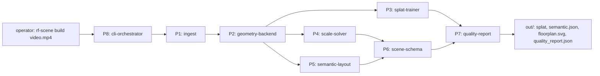
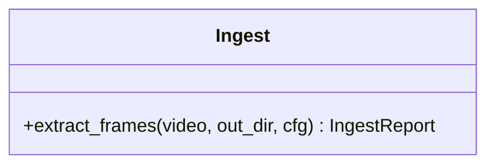
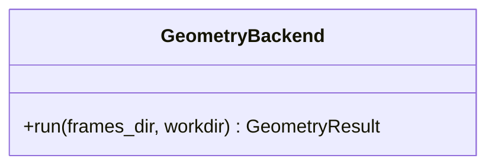
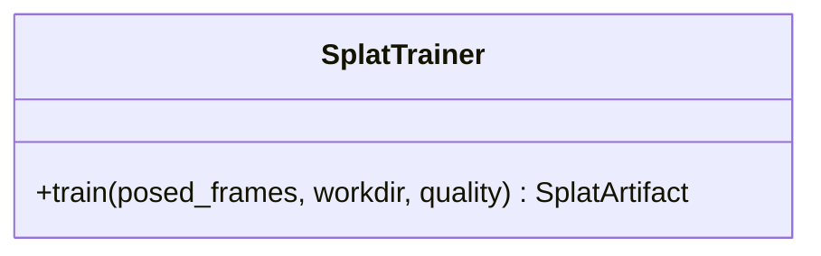
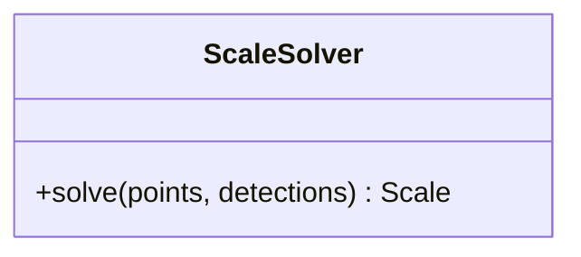
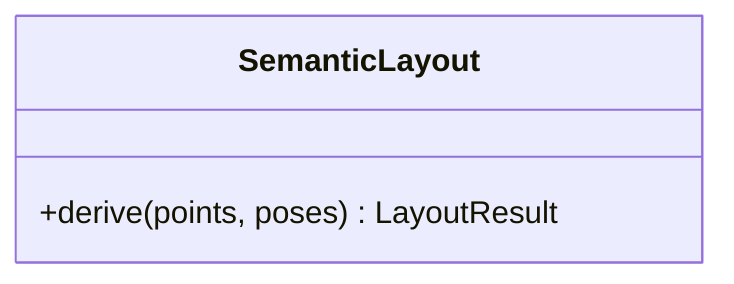
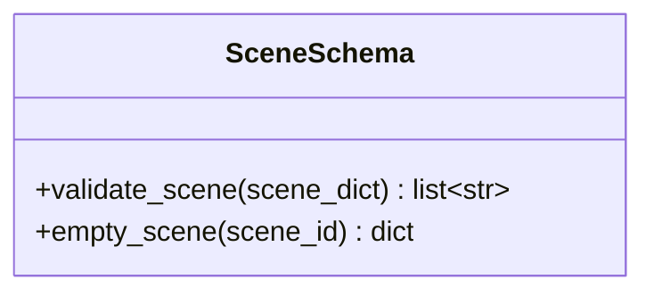
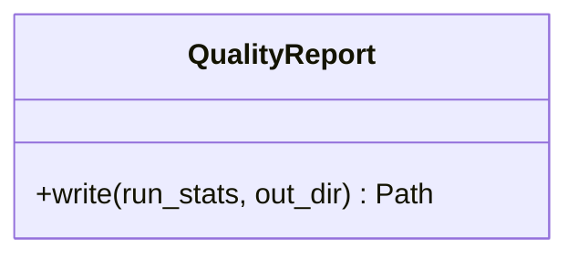
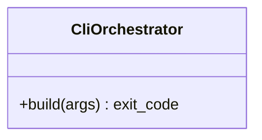

# DO-012 — SceneForge Phase-1 CLI — video-to-walkthrough pipeline

A command-line assembly that turns one handheld phone video into a compressed splat, a semantic scene JSON, a floor plan, and a quality report, existing to satisfy the constraint that bad captures fail loudly with a coverage report instead of producing hallucinated geometry (docs/BUILD_BRIEF.md §2).

## ASSEMBLY DRAWING

The operator invokes P8 with a video path; P8 drives P1 frame selection, hands surviving frames to P2 for poses and points, fans out to P3, P4, and P5, assembles their outputs through P6 into the frozen scene contract, and P7 writes the quality report and output bundle. No stage writes outside the run's output directory.

## BILL OF MATERIALS

| Part | Name | Kind | Responsibility | Deps | Ref |
|------|------|------|----------------|------|-----|
| P1 | ingest | module | Extract, blur-filter, and dedupe frames from the input video, or raise on inadequate capture. | none | local |
| P2 | geometry-backend | assembly | Produce camera poses and a dense point cloud from frames behind one swappable interface (lingbot-map primary, COLMAP+GLOMAP fallback). | P1 | local |
| P3 | splat-trainer | module | Train and compress the Gaussian splat from posed frames. | P2 | local |
| P4 | scale-solver | module | Recover approximate metric scale from door-height priors with stated confidence. | P2 | local |
| P5 | semantic-layout | module | Derive rooms, walls, and openings from the point cloud slice and 2D detections. | P2 | local |
| P6 | scene-schema | module | Define and validate the frozen semantic scene JSON contract, schema_version 1.0. | none | local |
| P7 | quality-report | module | Aggregate per-stage statistics into quality_report.json and decide pass or fail-loud. | P1 | local |
| P8 | cli-orchestrator | module | Parse arguments, sequence stages, map stage errors to distinct exit codes. | P1 | local |

## DETAIL DRAWINGS

### P1 — ingest

Invariants: frames are sampled at cfg.fps then rejected by variance-of-Laplacian below cfg.blur_threshold and by consecutive-frame mean absolute difference below cfg.dup_threshold; survivors are uniformly subsampled to at most cfg.max_frames; fewer than cfg.min_frames survivors raises IngestError and leaves no partial frames directory. The report records extracted, blur_rejected, dup_rejected, and kept counts for P7.

### P2 — geometry-backend

Interface only at this revision: GeometryBackend.run(frames_dir, workdir) returns poses, points, and confidence, or raises StageUnavailable when the execution environment lacks the required GPU. Adapters registered by name: lingbot (primary, Apache-2.0, pinned commit) and colmap (fallback). Implementation is deferred to the GPU environment; the interface and unavailability contract are frozen here.

### P3 — splat-trainer

Interface only at this revision: train(posed_frames, workdir, quality) returns a compressed splat artifact at or under the 25 MB budget. Deferred to the GPU environment behind the same StageUnavailable contract as P2.

### P4 — scale-solver

Interface only at this revision: solve(points, detections) returns scale with method and confidence fields; when no door is detected it returns method none and confidence 0.0 rather than guessing.

### P5 — semantic-layout

Interface only at this revision: derive(points, poses) returns rooms, walls, and openings for P6; the deterministic slice-and-polygonize baseline specified in docs/BUILD_BRIEF.md §4.5 is the reference implementation.

### P6 — scene-schema

Invariants: schema_version is the literal string 1.0; units is meters; validate_scene returns an empty error list only when every required top-level key is present with the required type; unknown extra keys are rejected so the contract cannot drift silently.

### P7 — quality-report

Invariants: every classified run outcome writes exactly one quality_report.json with status succeeded, failed_capture, or stage_unavailable; unexpected exceptions exit 1 without fabricating a status; the report never claims coverage it did not measure.

### P8 — cli-orchestrator

Invariants: exit 0 on success, exit 2 on failed_capture, exit 3 on stage_unavailable, exit 1 on unexpected errors; stdlib argparse only; every run creates the output directory before any stage executes so a report can always be written.

## CONTRACTS & TOLERANCES

| Operation | Input domain | Nominal behavior | Tolerance | Inspection op | Failure mode outside tolerance |
|-----------|--------------|------------------|-----------|---------------|--------------------------------|
| extract_frames(video, out_dir, cfg) | readable video file ffmpeg can decode | Samples frames at cfg.fps, rejects blur and near-duplicates, subsamples to cap, writes JPEG frames and returns IngestReport | kept count within [cfg.min_frames, cfg.max_frames]; blur threshold variance-of-Laplacian 60.0 exact at defaults | Op 30 | Raises IngestError; out_dir removed; caller sees failed_capture |
| validate_scene(scene_dict) | any Python dict | Checks the frozen 1.0 contract keys and types | exact match to schema_version 1.0 key set; zero tolerance for unknown top-level keys | Op 20 | Returns non-empty error list; P8 refuses to write semantic.json |
| get_backend(name) | name in {lingbot, colmap} | Returns the registered GeometryBackend adapter | exact registry membership | Op 50 | Raises KeyError listing registered names |
| build(video, out, quality, backend) | existing video path; writable out path | Runs P1 then P2..P7, writes artifacts and quality_report.json | end-to-end at or under 20 minutes on a T4 for a 90 s 1080p capture; in a CPU-only environment stops after P1 with status stage_unavailable | Op 40 | Exit code 2 or 3 with quality_report.json present; never a partial splat presented as complete |

## PROCESS PLAN

| Op | Task | Tooling | Inspection |
|----|------|---------|------------|
| 10 | Package scaffold: pyproject with rf-scene console script, importable sceneforge_pipeline | python, pip editable install | pip install -e pipeline succeeds and rf-scene --help exits 0 |
| 20 | P6 scene-schema module with validate_scene and empty_scene | python stdlib | pytest tests/test_schema.py green |
| 30 | P1 ingest module with blur and duplicate rejection | ffmpeg, opencv, numpy | pytest tests/test_ingest.py green against synthetic sharp and blurred videos |
| 40 | P7 quality-report writer and P8 orchestrator with exit-code contract | python stdlib | rf-scene build on a synthetic video in this CPU sandbox exits 3 and writes quality_report.json with status stage_unavailable |
| 50 | P2 GeometryBackend interface, registry, and lingbot adapter shell with pinned-commit and license-verification notes | python | pytest tests/test_geometry_registry.py green; adapter raises StageUnavailable on CPU |
| 60 | GPU environment implementation of P2, P3 per docs/BUILD_BRIEF.md §4.2–4.3 | torch, lingbot-map, gsplat on T4 or A10 | first-article run on a real 90 s capture meets the Op 40 build tolerance |

## REVISION HISTORY

| Rev | Date | Author | Change summary |
|-----|------|--------|----------------|
| A | 2026-07-18 | Febin William | Initial draft of the Phase-1 CLI assembly. |
