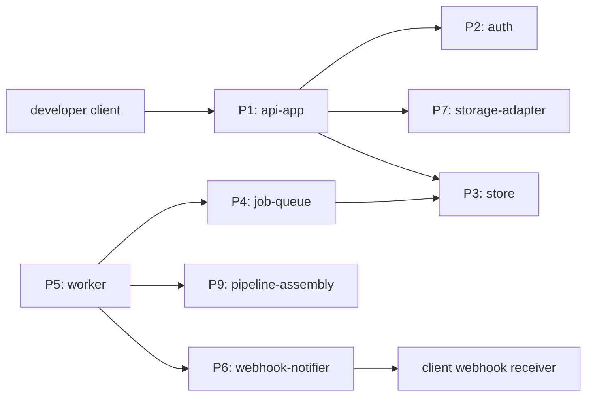
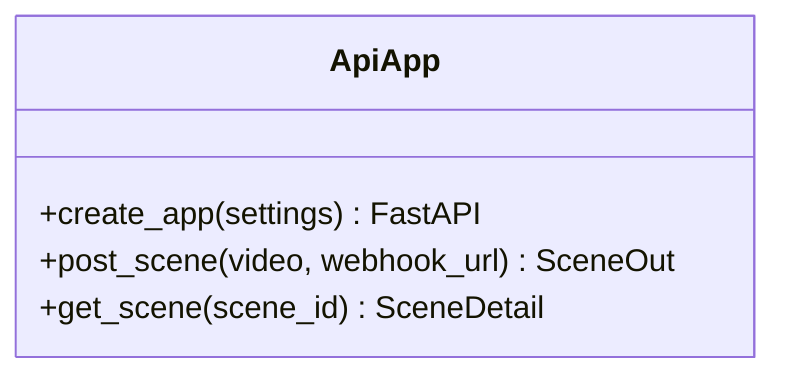
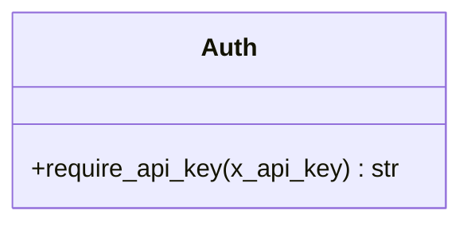
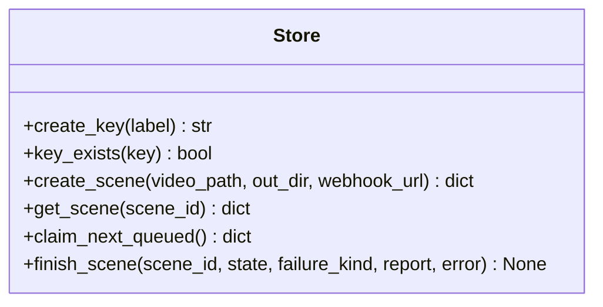
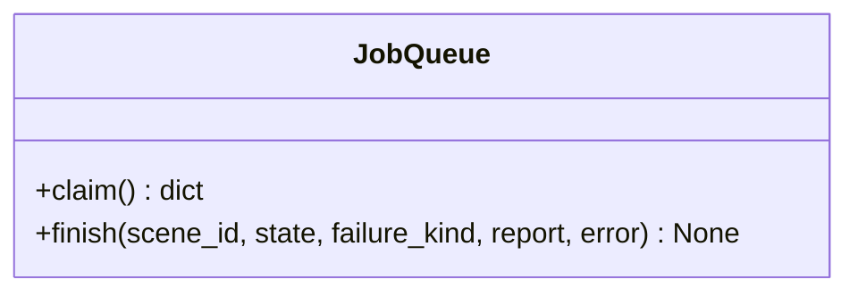
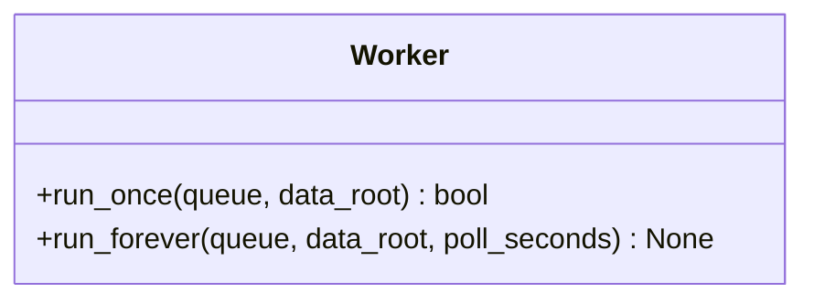
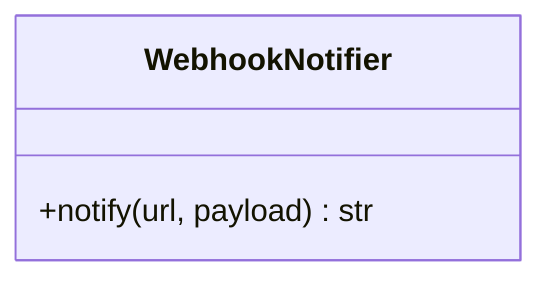
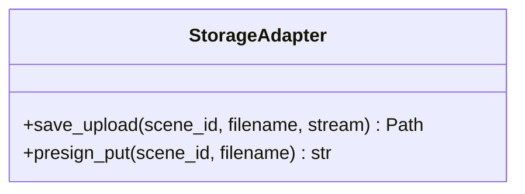
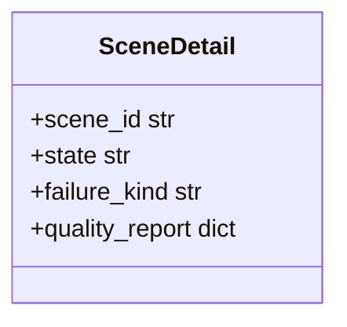

# DO-013 — SceneForge Phase-2 API — scenes, jobs, auth, webhooks

An HTTP service and worker assembly that accepts a walkthrough video upload, runs the DO-012 pipeline asynchronously, and reports honest job outcomes, existing to satisfy the constraint that the API host (CPU, ARM-safe) and the GPU pipeline are separate machines joined only by a queue (docs/BUILD_BRIEF.md §5).

## ASSEMBLY DRAWING

A client authenticates through P2 and posts a video; P1 persists the upload through P7, records a queued scene in P3, and returns immediately. P5 polls P4 for queued scenes, invokes P9 on the stored video, writes the terminal state and quality report back through P3, and fires P6 when a webhook URL was registered. No route blocks on pipeline execution.

## BILL OF MATERIALS

| Part | Name | Kind | Responsibility | Deps | Ref |
|------|------|------|----------------|------|-----|
| P1 | api-app | module | FastAPI application factory and the /v1/scenes routes. | P2, P3, P7, P8 | local |
| P2 | auth | module | X-API-Key header verification against the keys table. | P3 | local |
| P3 | store | module | SQLite persistence for api_keys and scenes with atomic job claiming. | none | local |
| P4 | job-queue | module | Queue facade over P3 claiming so Redis/RQ can replace it without route changes. | P3 | local |
| P5 | worker | module | Poll loop that claims a scene, runs the pipeline, records the outcome. | P3, P4, P6, P9 | local |
| P6 | webhook-notifier | module | Deliver terminal-state payloads to the registered URL with bounded retries. | none | local |
| P7 | storage-adapter | module | Persist uploads under the data root; presign interface reserved for R2. | none | local |
| P8 | dto | module | Pydantic response contracts for scene state and detail. | none | local |
| P9 | pipeline-assembly | assembly | The DO-012 CLI executed per scene with its exit-code contract. | none | DO-012 |

## DETAIL DRAWINGS

### P1 — api-app

Invariants: POST /v1/scenes returns 202 with state queued before any pipeline work; GET /v1/scenes/{id} returns 404 for unknown ids; /healthz requires no auth; the app never imports GPU code.

### P2 — auth

Invariants: a missing or unknown key yields 401 with detail "invalid or missing API key"; keys are opaque tokens, never logged in full.

### P3 — store

Invariants: scene state is one of queued, processing, succeeded, failed; claim_next_queued flips queued to processing in a single UPDATE with RETURNING so two workers cannot claim one scene; SQLite runs in WAL mode; the Postgres swap at deploy changes the DSN, not the interface.

### P4 — job-queue

Invariants: the facade exposes only claim and finish; replacing SQLite polling with Redis/RQ on OCI touches this part alone.

### P5 — worker

Invariants: pipeline exit codes map exactly as 0 to succeeded, 2 to failed with failure_kind failed_capture, 3 to failed with failure_kind stage_unavailable, anything else to failed with failure_kind error; quality_report.json is copied into the scene row when present; a worker crash never leaves a scene in processing without an error recorded.

### P6 — webhook-notifier

Invariants: at most 3 attempts with 5-second timeouts; the result string is delivered or failed; delivery failure never changes the scene state.

### P7 — storage-adapter

Invariants: LocalStorageAdapter writes under data_root/uploads/scene_id and is the dev default; presign_put raises NotImplementedError until the R2 adapter lands at deploy (docs/BUILD_BRIEF.md §5).

### P8 — dto

Invariants: responses expose exactly the contract fields; internal paths (video_path, out_dir) never leave the service.

### P9 — pipeline-assembly

External part — see DO-012: the worker invokes rf-scene build and consumes its exit-code and quality_report.json contract unchanged.

## CONTRACTS & TOLERANCES

| Operation | Input domain | Nominal behavior | Tolerance | Inspection op | Failure mode outside tolerance |
|-----------|--------------|------------------|-----------|---------------|--------------------------------|
| post_scene(video, webhook_url) | authenticated multipart upload with a video file part | Persists upload, records queued scene, returns 202 SceneOut | response before any pipeline execution; state literal queued | Op 30 | 401 without valid key; 422 without a video part |
| get_scene(scene_id) | any string id with valid key | Returns state, failure_kind, quality_report, timestamps | state in the exact set queued, processing, succeeded, failed | Op 30 | 404 body detail scene not found |
| require_api_key(header) | any request | Passes known keys, rejects others | 401 detail exactly "invalid or missing API key" | Op 20 | request never reaches the route body |
| run_once(queue, data_root) | zero or more queued scenes | Claims one scene, runs DO-012 pipeline, records terminal state | exit-code map exact per P5 invariants; each scene claimed at most once | Op 40 | scene marked failed with failure_kind error and the exception text |
| notify(url, payload) | terminal-state scene with webhook_url | POSTs JSON payload | at most 3 attempts, 5 s timeout each | Op 50 | returns failed; scene state unchanged |

## PROCESS PLAN

| Op | Task | Tooling | Inspection |
|----|------|---------|------------|
| 10 | api package scaffold with fastapi, uvicorn, httpx, python-multipart and console scripts rf-scene-worker, rf-scene-admin | python, pip editable install | pip install -e api succeeds and pytest collects the suite |
| 20 | P3 store and P2 auth with seeded key | python stdlib sqlite3 | pytest api/tests/test_store_auth.py green |
| 30 | P1 routes and P8 dto over TestClient | fastapi TestClient | pytest api/tests/test_routes.py green including 401, 404, 422 |
| 40 | P5 worker end to end against a real synthetic capture in this CPU sandbox | ffmpeg, DO-012 pipeline | pytest api/tests/test_worker.py green: stage_unavailable and failed_capture both observed through the API |
| 50 | P6 webhook delivery against a local receiver | python http.server thread | pytest api/tests/test_webhook.py green: payload received, retries bounded |
| 60 | Live demonstration: uvicorn serving, key minted, video posted, worker tick, honest failed state fetched | uvicorn, curl | transcript in DECISIONS.md shows 202 queued then failed with failure_kind stage_unavailable |

## REVISION HISTORY

| Rev | Date | Author | Change summary |
|-----|------|--------|----------------|
| A | 2026-07-18 | Febin William | Initial draft of the Phase-2 API assembly. |
