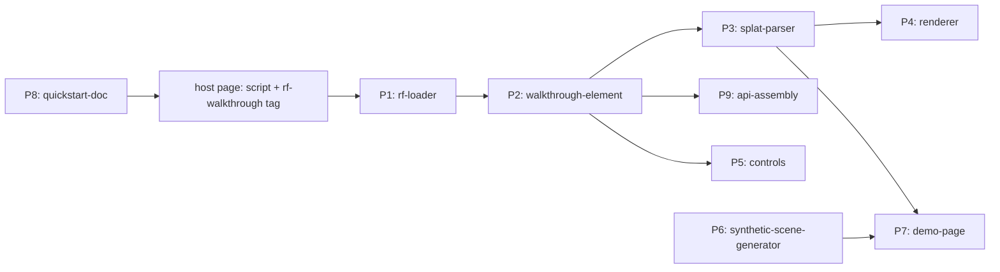
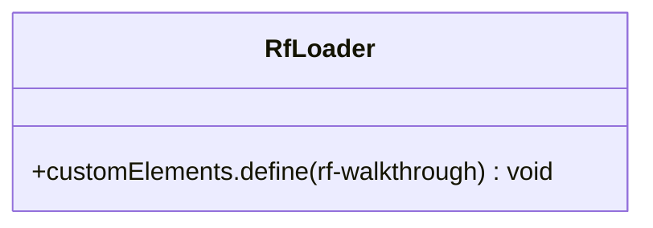
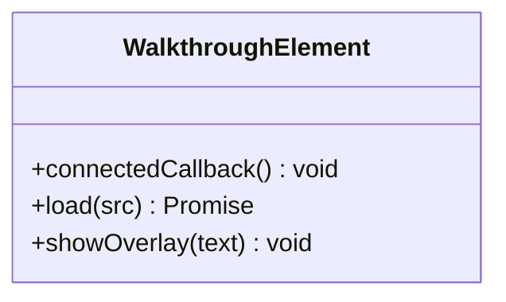
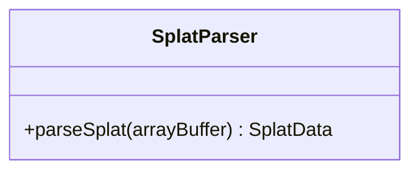
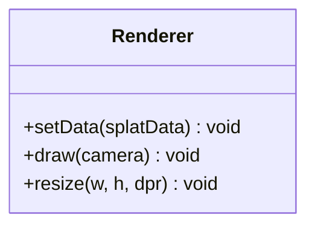
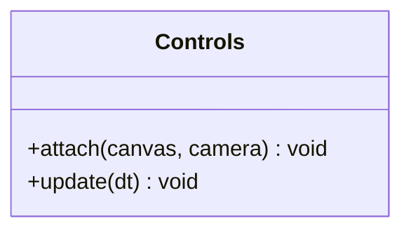
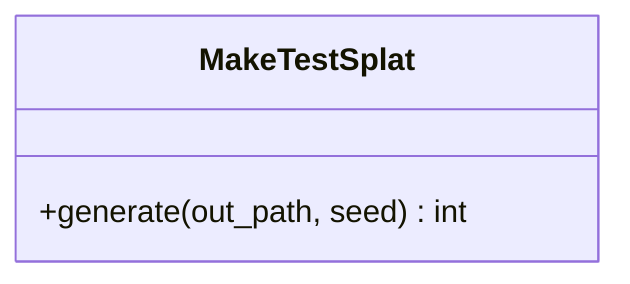

# DO-014 — SceneForge Phase-3 viewer — embeddable walkthrough element

A single-file web component that renders a compressed splat scene in any third-party page from one script tag and one element, existing to satisfy the constraint that a developer integrates the walkthrough in at most ten lines (docs/BUILD_BRIEF.md §6 Phase 3).

## ASSEMBLY DRAWING

The host page loads P1, which registers P2 as a custom element. P2 resolves its splat source directly from a src attribute or through P9's scene endpoint, streams the buffer into P3, and hands typed arrays to P4 while P5 maps pointer and touch input to the camera. P6 manufactures a synthetic room so P7 and the tests run without the GPU pipeline. P8 tells a stranger how to do all of this in ten lines.

## BILL OF MATERIALS

| Part | Name | Kind | Responsibility | Deps | Ref |
|------|------|------|----------------|------|-----|
| P1 | rf-loader | module | Single-file distribution that registers the custom element on load. | P2 | local |
| P2 | walkthrough-element | class | Custom element lifecycle: attributes, fetch, overlays, wiring parser to renderer and controls. | P3, P4, P5 | local |
| P3 | splat-parser | function | Decode the 32-byte-per-splat binary layout into typed arrays. | none | local |
| P4 | renderer | class | WebGL2 depth-sorted point-sprite rendering of the parsed splats. | none | local |
| P5 | controls | class | Orbit, pinch and wheel zoom, pan, and basic walk mode over one camera state. | none | local |
| P6 | synthetic-scene-generator | module | Python tool emitting a synthetic room in the exact splat byte layout for tests and the demo. | none | local |
| P7 | demo-page | module | Static page embedding the element against the synthetic scene, served over plain HTTP. | P1, P6 | local |
| P8 | quickstart-doc | module | Integration document whose embed snippet is at most ten lines. | none | local |
| P9 | api-assembly | assembly | The DO-013 scene endpoint consumed in scene-id mode for asset resolution. | none | DO-013 |

## DETAIL DRAWINGS

### P1 — rf-loader

Invariants: rf.js is one dependency-free file; loading it twice is harmless (define is guarded); no globals leak beyond the RF namespace.

### P2 — walkthrough-element

Invariants: with neither src nor scene-id the overlay shows exactly "rf-walkthrough: missing src or scene-id"; fetch and parse failures surface in the overlay, never as silent blank canvases; in scene-id mode a scene without assets.splat_url shows the scene state instead of an error.

### P3 — splat-parser

Invariants: layout is 32 bytes per splat - float32 x,y,z; float32 scale x,y,z; uint8 r,g,b,a; uint8 quaternion w,x,y,z scaled to 0..255; a buffer whose length is not a multiple of 32 throws "invalid splat buffer length"; the quaternion is decoded and retained for the rev B quad renderer but unused by P4 at rev A.

### P4 — renderer

Invariants: splats draw as camera-facing point sprites sized by projected world scale, alpha-blended far-to-near with depth test off; the CPU depth sort re-runs only when the camera has moved beyond a threshold and at most once per 100 ms; rev A budget is 200000 splats; full elliptical quad splatting is deferred to rev B by design, not by accident.

### P5 — controls

Invariants: one-pointer drag orbits, two-pointer pinch dollies and pans, wheel dollies; walk mode toggles WASD translation with drag look; controls never mutate renderer state directly, only the shared camera.

### P6 — synthetic-scene-generator

Invariants: output is deterministic for a fixed seed; the scene contains a floor, two walls, and a table-shaped cluster within a 4 by 3 meter footprint so orbiting reads as a room; splat count stays under 20000 so the demo loads instantly on a phone.

### P7 — demo-page

Commodity part — no drawing needed: one static HTML file embedding the element exactly as QUICKSTART.md shows, served by python3 -m http.server.

### P8 — quickstart-doc

Commodity part — no drawing needed: markdown whose embed snippet is copy-pasteable and at most ten lines including both script and element.

### P9 — api-assembly

External part — see DO-013: scene-id mode calls GET /v1/scenes/{id} and reads assets.splat_url once the GPU stage publishes it; until then the element reports the scene state honestly.

## CONTRACTS & TOLERANCES

| Operation | Input domain | Nominal behavior | Tolerance | Inspection op | Failure mode outside tolerance |
|-----------|--------------|------------------|-----------|---------------|--------------------------------|
| parseSplat(buffer) | any ArrayBuffer | Decodes positions, scales, colors, rotations into typed arrays | count equals byteLength divided by 32 exactly | Op 30 | throws Error "invalid splat buffer length" |
| generate(out_path, seed) | writable path, integer seed | Writes the synthetic room splat file | byte length divisible by 32 exact; count under 20000; identical bytes for identical seed | Op 20 | test failure; no partial file kept |
| load(src) | reachable or unreachable URL | Streams, parses, and renders the scene | overlay text on failure within one fetch cycle; no silent blank canvas | Op 40 | overlay shows the failure reason |
| embed snippet | QUICKSTART.md reader | Integrates the viewer in a host page | snippet at most 10 lines including script and element | Op 50 | documentation fails inspection |
| serve demo | python3 -m http.server over demo directory | Serves rf.js, the splat, and index.html | HTTP 200 for all three assets | Op 50 | curl inspection fails |

## PROCESS PLAN

| Op | Task | Tooling | Inspection |
|----|------|---------|------------|
| 10 | Single-file rf.js with element registration, parser, renderer, controls | plain JavaScript, WebGL2 | node --check viewer/src/rf.js exits 0 |
| 20 | P6 generator emitting the synthetic room | python, numpy | pytest viewer/tests/test_generator.py green |
| 30 | P3 parser verified against generator output | node test runner | node viewer/tests/test_parser.mjs green: count and bounds match the generator |
| 40 | P2 element overlays and source resolution logic | plain JavaScript | node viewer/tests/test_element_logic.mjs green on the extracted pure functions |
| 50 | P7 demo page, P8 quickstart, served and probed | python http.server, curl | curl returns 200 for index.html, rf.js, test_scene.splat; embed snippet is 10 lines or fewer |
| 60 | Visual first article on a real phone: orbit, pinch, walk | any phone browser over LAN or hosted demo | first-article report filed per templates/FIRST-ARTICLE-REPORT-template.md |

## REVISION HISTORY

| Rev | Date | Author | Change summary |
|-----|------|--------|----------------|
| A | 2026-07-18 | Febin William | Initial draft of the Phase-3 viewer assembly. |
